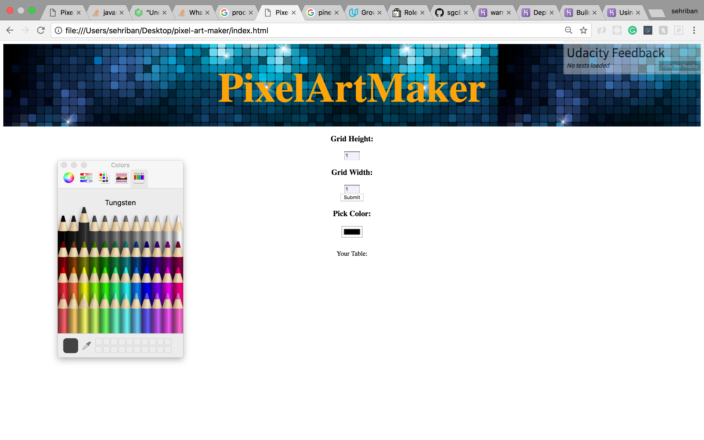
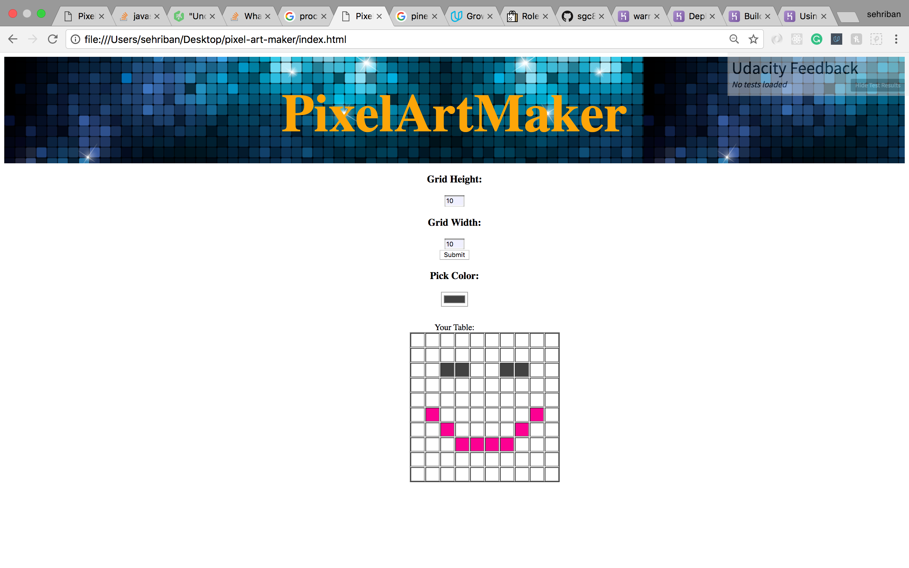

Pixel Art Maker
===================
Google- Udacity Scholership 2018
===================

**PixelArtMaker** is an app that we can dynamically create pixel with any size we want and paint them with any color using color-picker.

----------

----------

----------

**Sherry Cheng** - https://github.com/sgc88

----------

Technologies
-------------------
  * HTML
  * javaScript
    - addEventListener
    - nested for loops.
    - parseInt
    - insertCell
    - setAttribute
  * CSS

----------

Existing Features
-------------------
* Users can create and paint canvas they have created.
* Users can use Google map to search for places for reference.

----------

Planned Features
-------------------
* User authentication and authorization.
* Users can show, create, update, and delete table.
* Users can save their existing tables that they have created and painted.
